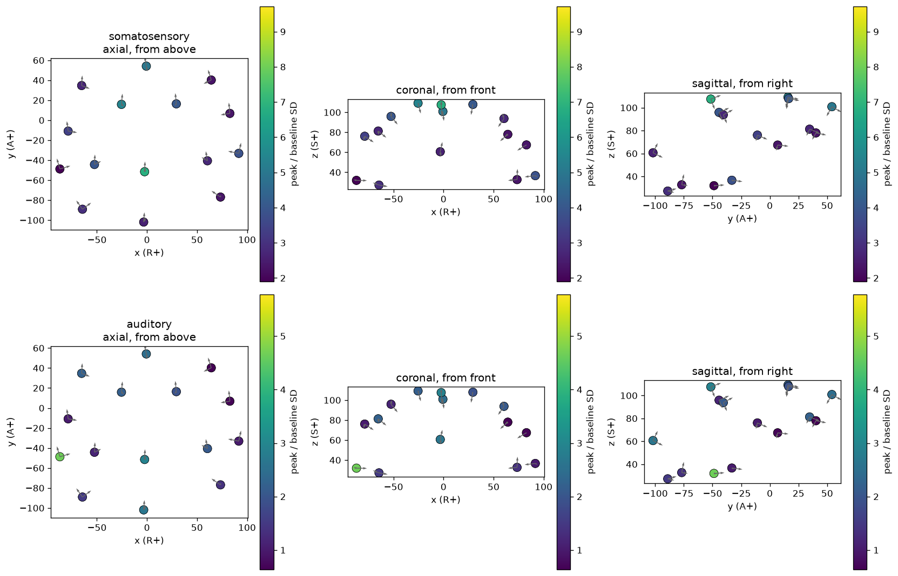

# opm-evoked-analysis

Analysis of the OPM-MEG recordings in [dataset, ATR/NICT - simultaneous OPM,
SQUID and EEG], covering the four subjects with OPM data.

Each subject had an array of 15 sensors concentrated over the superior and posterior scalp. Each of these sensors produces 2 different channels, 1 per axis. In this dataset, the auditory data M100 is not detectable in global field power across all of the 30 channels each subject has.  After restricting the data to be only the two sensors closest to the superior temporal gyrus, which contains the auditory cortex, it exceeds a permutation-based null built from the same recording in two of three held-out subjects with peaks at 96 and 109 ms. Averaging these sensors with the other 28 does not seem to let any notable response to auditory stimulus be seen. All-channel's probability value was 0.11-0.43, however, with just the two better positioned sensors it was 0.0010-0.0350, showing the difference in detectability. Furthermore, repeating this test on the somatosensory data, specified to the more somatosensory-positioned sensors reports results in the same direction, showing much lower p values with the better positioned sensors. The somatosensory data also reported two subjects clearing the null even with all channels averaged, unlike auditory which only cleared 2/3 times with the two auditory-specific sensors.

An earlier version of this repository reported a result that was wrong. See
[what I got wrong](#what-i-got-wrong).

## Dataset
The dataset used contains 15 different OPM-MEG sensors, concentrated specifically around the posterior and superior scalp. The exact positioning of these sensors is: 

  

 
Each of these sensors measures two different channels, one per axis. The sensors are 10 QuSpin QZFM Gen-2 and 5 Gen-3, and read at a sampling rate of 2 kHz. Physically, because of how MEG works on a fundamental level, they were setup in a magnetically shielded room with a field-nulling coil (an electromagnet designed to cancel out background magnetic field) to keep the total magnetic field background level below 1 nT. Finally, the subjects themselves would rest their chins on a chin rest during the data collection, meaning movement artifacts are largely suppressed. In the dataset, four of the subjects have OPM data (002, 005, 006, and 093). This analysis specifically uses the auditory tone data and the right median nerve tasks. These recordings are shielded and head-fixed, meaning nothing is showing performance of the OPM sensors under head motion.  

## Methods

### Preprocessing
The dataset authors' published pre-processing was not applied (homogeneous field correction, detrending, manual bad-channel exclusion, and EOG regression). Trials above the 85th percentile of peak-to-peak amplitude are rejected. Epochs are -400 to +300 ms, and the baseline is from -300 to -50 ms.
Auditory
 - band-pass 2-20 Hz
 - shifted 60 ms due to acoustic lag
Somatosensory
 - band-pass 2-100 Hz, notch at 60 Hz due to the power grid in Kansai, Japan
 - no lag

### The Statistic
Global Field Power
- Global Field Power (GFP) is the root-mean-square of the trials, first averaged together, across the selected channels. This is computed at each time point, which allows us to make 30 channels one result, or just 4 channels one result when doing the geometry-selected test. 

Test Statistic
- The test statistic is the maximum of that trace inside a window. It is fixed in advance. In the auditory data, M100, it is 70-150 ms, and 15-60 ms for the early somatosensory component. These both come from published latencies in the component. 

### The Surrogate Null
A surrogate null is an artifical piece of data that mimics the predicted null hypothesis (the assumption that the data is generated by a simpler process like random noise in this case). 

Each surrogate null generated uses the exact same continous recording. They each use the same number of triggers placed at uniformly random times, before then running identical epoching, baseline correction, trial rejection, averaging, GFP calculation, and maximum-in-window calculation. This is performed two thousand times per test in order to ensure accuracy.

The value p is the fraction of the surrogate maxima at or above the observed real data maxima. One is added to the numerator and denomintor. This is done to count our observed data as another possiblity, preventing p from ever being exactly 0. The smallest p possible to report is 1/2001, or ~0.05%. 

## Results
Peak and latency columns are from the selected pair of channels, not all 30.
| Subject | All 30 channels | Two sensors nearest auditory cortex | Peak | Latency |
|---|---|---|---|---|
| 002 *(exploratory)* | p = 0.181 | p = 0.020 | 232 fT | 90 ms |
| 005 | p = 0.429 | **p = 0.0010** | 373 fT | 96 ms |
| 006 | p = 0.124 | **p = 0.0350** | 372 fT | 109 ms |
| 093 | p = 0.110 | p = 0.0090 | 612 fT | 100 ms |

 Even though 093's p-value was very low, it is excluded because its somatosensory control failed (p = 0.103), and that control was set in advance as a precondition for counting a subject's auditory result. Somatosensory control is the check that a subject's recording can detect a response known to be large, as somatosensory response is known to be a large signal in prior literature. If it were to be included, auditory would be three for three. The gated figure was reported because the rule was fixed before the data was opened. 

